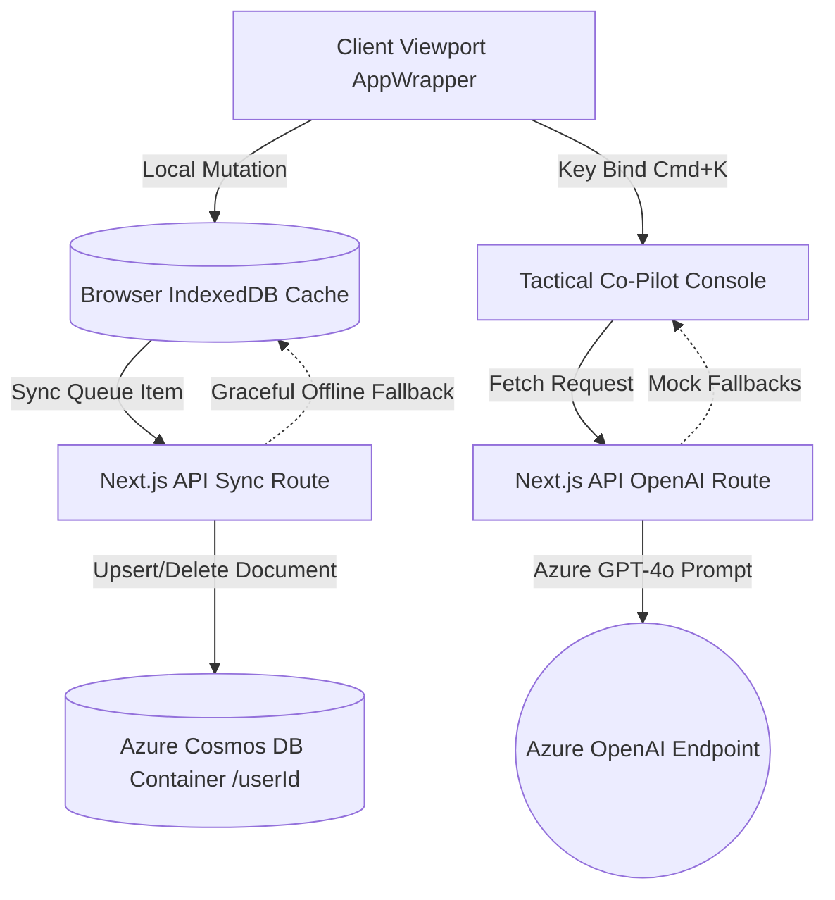

# The Prime Journal (v1.0.0)

> **The Prime Journal** is a high-integrity, engineering-grade life optimization system disguised as a tactile role-playing game notebook interface. 

It rejects shallow, dopamine-heavy extrinsic gamification in favor of a clean, structured psychological engine tailored for the **Systems Engineer / Cartographer** archetype. It tracks daily habits, option trading discipline, software development milestones, and family loops within a high-contrast digital notebook.

---

## Table of Contents
1. [Core Features & Gamified Mechanics](#core-features--gamified-mechanics)
2. [Design Aesthetics (Parchment & Ink Theme)](#design-aesthetics-parchment--ink-theme)
3. [System Architecture & Data Flow](#system-architecture--data-flow)
4. [Environment Configuration](#environment-configuration)
5. [Getting Started (Run Instructions)](#getting-started-run-instructions)

---

## Core Features & Gamified Mechanics

### 1. The Star Economy & Completion Guard
When completing quest-related tasks, the system intercepts the action and displays the **3-Line Inline Completion Guard**:
*   **1★ (Mechanic Execution) [+10 XP]:** Minimum acceptable routine completed.
*   **2★ (System Mastery) [+25 XP]:** Flawless mechanical discipline without shortcuts.
*   **3★ (The Codex Exception) [+50 XP + Loot Box Roll]:** Exceptional execution. Selecting $3\bigstar$ dynamically opens a **mandatory log note area** to document lessons or system friction before committing.

### 2. The Codex Loot Box Engine & Confetti Celebrations
*   **Loot Box Roll:** Committing a $3\bigstar$ task triggers a background roll: $\text{Bonus XP} = \text{RandomInteger}(5, 15)$.
*   **Tier I Burst:** Fast gold/slate confetti shooting from checkboxes and a *Solo Leveling* notification banner for $1\bigstar$ and $2\bigstar$ clears.
*   **Tier II Chest Reveal:** Floating loot chest unboxing animation with color confetti for $3\bigstar$ clears.
*   **Tier III Promotion:** Cascading gold/crimson rain and a *Black Clover* Limit Break overlay when leveling up or clearing Major Quests.

### 3. Absolute Sunday Clean Slate & Monday Lockout
*   **Sunday Slate Wipe (11:59:59 PM):** Uncompleted daily focus tasks are forcibly wiped from today's list and returned to the general backlog, preventing guilt spirals and stack anxiety.
*   **Monday Re-Budgeting Ritual:** On Monday morning, the dashboard is completely locked out. The user must manually review backlog tasks and drag/commit them onto the weekly operational ledger. The dashboard unlocks only when the weekly slate is locked.
*   **Overload Warning:** If committed minutes exceed $110\%$ of the daily/weekly budget settings, the UI mounts an amber alert warning.

### 4. Dual Bifrost AI Core
*   **Tactical Co-Pilot (Cmd+K Console):** Real-time command overlay. 
    *   `/breakdown-quest [title]` parses long text parameters to generate 3–5 SMART minor quests.
    *   `/verify-trade [ticker] [strategy]` audits option contract criteria against strict compliance rules.
*   **Grand Cartographer Analyst:** Refreshes on demand. Analyzes weekly Codex log notes to identify psychological slippage patterns, success factors, and computes the dynamic **Discipline Matrix Index**.

---

## Design Aesthetics (Parchment & Ink Theme)

Derived from the visual components in [Stitch URL](https://stitch.withgoogle.com/projects/18143509332858883553):
*   **Canvas Background:** `#fdf9f0` (natural parchment texture overlay).
*   **Ink Typography:** `#442a22` (deep warm-brown primary text).
*   **Earthy Accent:** `#775a19` (soft earth brown secondary details).
*   **Gamified Highlights:** Solo Leveling Azure Blue (`#0ea5e9`) and Clover Grimoire Gold (`#eab308`).
*   **Typography:** Elegant serif `Literata` for all display titles and clean sans-serif `Manrope` for readability in labels and body paragraphs.
*   **Transitions:** Spacious layout blocks with smooth $+1.5\%$ hover expansion:
    `transition: transform 0.3s cubic-bezier(0.25, 1, 0.5, 1)`.

---

## System Architecture & Data Flow



### 1. Data Isolation Boundaries
All entities (`Seasons`, `MajorQuests`, `MinorQuests`, `Tasks`, `TaskCompletions`, `CharacterProfiles`) contain a unique `userId` field matching the database's partition key. This guarantees multi-tenant isolation profiles across execution boundaries.

### 2. Offline-First Operations
Mutations occur instantly in browser IndexedDB. An internal `syncQueue` processes transactions sequentially to update Azure Cosmos DB in the background. If Cosmos DB or network endpoints are offline, the client continues running locally with zero friction.

---

## Environment Configuration

Create a `.env.local` file in the root directory:

```env
# Azure OpenAI Integration
AZURE_OPENAI_ENDPOINT=https://your-resource-name.openai.azure.com/
AZURE_OPENAI_API_KEY=your-api-key
AZURE_OPENAI_DEPLOYMENT_NAME=gpt-4o

# Azure Cosmos DB Integration
AZURE_COSMOSDB_ENDPOINT=https://your-cosmos-db.documents.azure.com:443/
AZURE_COSMOSDB_KEY=your-cosmosdb-key
```

*Note: If these variables are not configured or contain default placeholders, the application automatically runs in an **offline-only mockup mode** with realistic AI outputs and local IndexedDB state persistence.*

---

## Getting Started (Run Instructions)

### Prerequisites
*   Node.js (v18.0.0 or higher)
*   npm (v9.0.0 or higher)

### Setup & Installation
1.  Clone the repository and navigate to the project root.
2.  Install dependencies:
    ```bash
    npm install
    ```
3.  Launch the development server:
    ```bash
    npm run dev
    ```
4.  Open [http://localhost:3000](http://localhost:3000) in your browser.

### Production Bundling
Compile the application into a type-safe production bundle:
```bash
npm run build
npm run start
```
